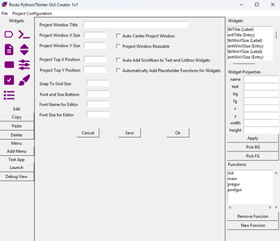

<a id="introduction"></a>


## Introduction  


***Rocks Python-Tkinter GUI Creator can create a GUI for Python-Tkinter by simply placing widgets in a window. Then it can automatically generate the app framework plus functions for the widgets and menus, that are in the GUI.***


When using the EXE version (once packaged with PyInstaller), the executable can run external Python scripts using the Python interpreter and bundled modules contained inside the PyInstaller packaged application (RPyTkGUICreator.EXE). The program is the GUI Creator AND the Runtime Environment for the built GUI 'All-In-One'.


**GUI Features:**


  - One click 'Launch App' to test GUI anytime during development.
  - Automatically generates the application framework in Python/Tkinter.
  - Automatically generates functions in Python/Tkinter for the widgets and menus if needed.
  - Same source code works when running normally under Python, and when packaged with PyInstaller (EXE version).
  - 'EXE version' of Rocks Python-Tkinter GUI Creator, is also the Python Runtime and Environment.
  - Creates simple to understand and to follow code with comments.
  - Implement a 'library' of code for your most used routines. Can be used or not.
  - Modular design. Any of the code blocks can be removed without causing errors.
  - Separate error handling captures errors. Shows the cause of the error in a separate window.
  - Code Editor will indent and unindent code with TAB and SHIFT+TAB keys.


**EXE Version Behaviour:**


  - External scripts receive normal sys.argv, plus correct script exit codes, along with stdout and stderr forwarding.
  - Ctrl+C / termination handling.
  - External scripts can import bundled modules.
  - Separate-process execution.
  - Child processes automatically use the same executable.
  - Designed to prevent accidental recursive launcher execution.
  - Works with both onefile and onedir PyInstaller builds. (Default 'onefile')
  - Does not require an installed Python when run via EXE package.
  - Does not require PYTHONPATH manipulation for bundled modules.
  - 'Good Code Base' for similar applications that need the PyInstaller EXE Version Behaviour designed into this application.


<a id="qindex"></a>


## Quick Index  


  - [Introduction](<#introduction>)
  - [Quick Index](<#qindex>)
  - [Summary](<#summary>)
  - [Widgets](<#widgets>)
  - [Edit](<#edit>)
  - [Menu](<#menu>)
  - [Test App](<#testapp>)
  - [Edit Widgets](<#editwidgets>)
  - [Code](<#code>)
  - [Download](<#download>)
  - [Installation](<#installation>)
  - [Run RPyTkGUICreator](<#run>)
  - [Create RPyTkGUICreator (EXE Version)](<#create-exe>)
  - [Acknowledgements / Credits](<#credits>)
  - [History](<#history>)
  - [License](<#license>)


* * *

<a id="summary"></a>


## Summary  


Rocks Python-Tkinter GUI Creator (RPyTkGUICreator) was mainly designed to build the GUI. It helps you place widgets in your window, get them arranged and named the way you want, add menus, then basically spit out a skeleton of an application that will run. Press the launch button. It will save it as 'debug_test.py'. And then automatically launch it for testing, right inside RPyTkGUICreator. 


But if you want to go ahead and throw some functions into your GUI, it is capable of building a fully functional app. 


Note: *I created the GUI for the 'Project Configuration' dialog box for RPyTkGUICreator using, RPyTkGUICreator. I also supply those files as well, to see a good example of how RPyTkGUICreator can be used to build a simple quick GUI.* See the folder: 'example_gui'


You do not need Python installed on your system to run the app if you build the EXE and you're running it from that. After you're done building the EXE, you can then use the command line, 'RPyTkGUICreator.exe --run-script yourapp.py' to run a GUI you've created. Like this: 


```python 
    RPyTkGUICreator.exe --run-script your_gui.py

```


Also...


```python 
    RPyTkGUICreator.exe --run-script your_gui.py arg1 arg2

```


So basically the RPyTkGUICreator.EXE is the 'script runner'. It uses the Python and modules packaged inside the EXE to run your GUI. And that is what is actually happening in the background when you click 'Launch' under 'Test App'. 


Launch uses 'itself', 'RPyTkGUICreator.exe' to run 'debug_test.py' file which is created in the EXE folder, each time you click 'Launch'.  
Like this:  

```python 
    RPyTkGUICreator.exe --run-script debug_test.py

```


Simple Enough... Let's continue. 


[Back to Top](<#top>) | [Quick Index](<#qindex>)   


* * *

<a id="widgets"></a>


## Widgets  


Included Widgets (top, left side of GUI) there is:  


  - Label
  - Text
  - Button
  - Checkbutton
  - Listbox
  - Entry
  - Spinbox
  - Scale
  - Canvas


You can add all of those widgets to the area in the middle of the screen. If you move your mouse over the widgets, a tool tip will appear. The tooltip will indicate what each widget is. 


[Back to Top](<#top>) | [Quick Index](<#qindex>)   


* * *

<a id="edit"></a>


## Edit  


In the Edit area, you have copy, paste and delete. 


To copy a widget: Click an already placed widget (that selects the widget), then click copy. Now click paste. You now have a copy of the widget. It's just that it is 'ON TOP' of the original widget, just click and drag the newly copied widget to where you want it placed. 


To delete a widget: The last 'clicked on' (selected) widget in the GUI, is the widget to be deleted. 


Copy, Paste and Delete is helpful when making forms and such. Lots of duplicate properties in same type of widget when making general forms and such. Create a widget, set it's properties, size, color etc... copy and then paste as many as needed into the rest of yur GUI. Renaming each widget as needed for your GUI project. 


[Back to Top](<#top>) | [Quick Index](<#qindex>)   


* * *

<a id="menu"></a>


## Menu  


Click on 'Add Menu' to add a new menu to your GUI. It creates one Menu at a time, with as many Menu Items under the Menu as you enter. 


So, click on 'Add Menu', then type in the menu name, for example 'File'. Then click ok. Afterwards it will ask you to enter in each individual menu item you want under your 'File' menu. So, next it's going to ask you for the menu item name because you're going to add a menu item. Say add 'Open', then click ok. Next enter 'Save', then click ok. Then enter 'Exit'. Then click ok. 


When you're done, don't enter in anything. Just leave it blank and click 'OK' and it'll be done. 


If you did it right, it'll add a menu. You'll see it inside the GUI creator, although it has no effect on RPyTkGUICreator. But, you can look over all the menu items to make sure they are correct. 


To add another menu, repeat the process.. 


Important Note: *You can not undo or change menus once created. You will have to start your GUI project over again.*


[Back to Top](<#top>) | [Quick Index](<#qindex>)   


* * *

<a id="testapp"></a>


## Test App  


Below there, we have Test App, with two buttons, 'Launch' and 'Debug View'. 


Upon first launching RPyTkGUICreator each time, you're presented with the 'blank' GUI creator user interface and right away you can test it by clicking 'Launch' which should minimize the GUI creator, and de-iconify it, and launch a blank top level window which is what you have so far because you haven't put anything on it or added any code or modified anything. 


Every time you click 'Launch' button it exports a file name 'debug_test.py' in the local directory, (overwrites the file if it exists) then launches it. 


If there's an error during launching the GUI, you will get an error window that pops up explaining where it is, along with the line numbers. 


You have to look at the 'debug_test.py' file that it exports when you click the launch button to find out what where the line number is that has the error, because the, 'debug_test.py' file is what's being actually run. 


You can then click on the 'Debug View' Button, which opens the 'debug_test.py' file, to look for the error. 


That way you can find the error then go back and find out what function it is in. 


[Back to Top](<#top>) | [Quick Index](<#qindex>)   


* * *

<a id="editwidgets"></a>


## Edit Widgets  


In the Widgets Listbox (top, right side of GUI) are all of the widgets that have been placed in the GUI so far. You can click on either the widget in the GUI, or in this list to select it and have it's properties copied to the properties boxes for editing. Select a widget, then edit one of it's properties, click 'Apply' to apply the new properties to the widget. I suggest renaming your widgets directly after placing them. 


If you 'double-click' a widget in the Widgets Listbox (top, right side of GUI), this will launch a 'Code Edit' window for editing code that is attached to the widget via 'command' or 'bind'. All done, and named automatically. It will open the code window with a template function ready to edit. The function is named 'f_widgetname'. Hence the 'f_' prefix, for 'function'. So, therefore all automatically RPyTkGUICreator generated functions are named using this same syntax. 'f_' preceeds the widget's name. I used 'command' to attach the function to the widgets that have 'command'. I used 'bind' for all others. Less variable and event passing with 'command'. 


After editing the widget function code, click 'Save' or 'Ok' to save your function named 'f_widgetname'. The new function is now listed in the listbox in the bottom right corner of RPyTkGUICreator. Automatically generated functions do not appear under 'Function'. *They are generated at export time :)* However the functions that do appear in the 'Functions' listbox are always generated at export time. Also once you have created a function for a widget, you can then either 'double-click' the widget in the 'Widgets' or 'Functions' listboxes on the right side in RPyTkGUICreator. 


Since the program automatically generates functions using this naming scheme, You, the user are basically 'over-riding' the automatically generated functions with your own function with the same name. When you export your GUI, depending on your 'Project Configuration', it will automatically generate functions for widgets (and Menus), each of which can be 'over-ridden', by creating a function with same name as RPyTkGUICreator automatically generates. Simple concept. The RPyTkGUICreator automatically generated functions serve as test code to see GUI imteraction during testing and also a 'ready-made' place to shove your code into. 


And for Menus, same naming scheme, except prefixed with an 'm_'.  
For a File menu that has menu items named, Open, Save and Exit, the RPyTkGUICreator automatically generated function names would be:  
'm_File_Open', 'm_File_Save', and 'm_File_Exit'.  

A function is created for every menu 'item'. Each can be 'over-ridden' by creating a function with same name. 


[Back to Top](<#top>) | [Quick Index](<#qindex>)   


* * *

<a id="code"></a>


## Code  


When you first start RPyTkGUICreator, under functions you have 'init' 'library' 'main' 'pregui' and 'postgui'. 'Init' runs before everything after the minimum is done to get a 'toplevel' window going. After that is the library code. Library is optional to use it. You can actually remove it. But there's some useful functions in there. 


Here's the 'Minimum GUI' to show where the code blocks all go, and also in what order they are arranged. 


```python 
    root = tk.Tk()
    # ---INIT CODE BLOCK---
    # ---LIBRARY CODE BLOCK---
    # ---CUSTOM USER FUNCTIONS CODE BLOCK---
    # --- WIDGETS TKVAR() & PYTHON FUNCTION CODE ---
    # ---MAIN CODE BLOCK---
    # ---PREGUI CODE BLOCK---
    # --- WIDGETS GUI CODE ---
    # ---POSTGUI CODE BLOCK---
    root.mainloop()

```


You can also add custom function in the functions box on the bottom right of the screen and you can click on there or the widget control. It'll bring up the same code until you have an entry in the functions box. 


Saving a project, will save a '.gui' file (which is the 'main project' file), a '.cfg' file and a '.code' file. When you Load a previously saved project, the '.gui' file is the one you are loading. The '.cfg' and '.code' files are automatically loaded along with the '.gui' project file. So basicaly, each project you save will save 3 files. 


  - '.gui' file - JSON file containing all of the widgets and menus.
  - '.code' file - JSON file containing all code for the functions that are to be included. (From the 'Functions' listbox, Auto-generated functions do not exist until export time, which is also 'Project Configuration' settings dependant.)
  - '.cfg' file - Plain text file containing a copy of the 'Project Configuration' settings, when saved.


Another thing about Rocks Python Tkinter GUI Creator is that if you use PyInstaller to create an EXE, all you need is the EXE you can deploy that to another computer and just run it once. One first run, it'll recreate the 'library.py' file, the 'theme.toml' file, and the 'config.txt' file in the local directory. 


To use RPyTkGUICreator.exe to run a python file:  

```python 
    RPyTkGUICreator.exe --run-script your_app.py

```


RPyTkGUICreator uses a similat technique to Test App in the GUI, since it always saved the test app to 'debug_test.py':  

```python 
    RPyTkGUICreator.exe --run-script debug_test.py

```


[Back to Top](<#top>) | [Quick Index](<#qindex>)   


* * *

<a id="download"></a>


## Download  


  - [Download RPyTkGUICreator from GitHub](<https://github.com/rock-stevens/rpytkguicreator/archive/refs/heads/main.zip>), and unzip to a folder where you want it installed.  
NOTE: The install WILL create a python virtual enviroment to install all of the packages, so it doesn't trash your system.


[Back to Top](<#top>) | [Quick Index](<#qindex>)   


* * *

<a id="installation"></a>


## Installation  


Download RPyTkGUICreator from GitHub, and unzip to a folder where you want it installed.  
NOTE: Python needs to be installed on your system and in your path. The install WILL create a python virtual enviroment to install all of the packages, so it doesn't trash your system. 

RPyTkGUICreator can be installed right from Explorer.  
Just navigate to the RPyTkGUICreator folder and double-click:


```python 
    install.bat

```


RPyTkGUICreator installer will install the needed Python packages in order to run the app.  
After installation of all of the packages, RPyTkGUICreator will be ready to run.


[Back to Top](<#top>) | [Quick Index](<#qindex>)   


* * *

<a id="run"></a>


## Run RPyTkGUICreator  


#### Run Windows Version  


To Run RPyTkGUICreator, it is pretty much the same as the installation, from Explorer.  
Just navigate to the RPyTkGUICreator folder, and this time double-click:


```python 
    run.bat

```


[Back to Top](<#top>) | [Quick Index](<#qindex>)   


* * *

<a id="create-exe"></a>


## Create RPyTkGUICreator (EXE Version)  


#### Create RPyTkGUICreator (EXE Version)  


To Create RPyTkGUICreator (EXE Version), there is a batch file supplied to make the EXE using PyInstaller.  
Just navigate to the RPyTkGUICreator folder, and this time double-click:


```python 
    build_exe.bat

```


When finished you'll have the file 'RPyTkGUICreator.exe' in your './dist' folder. 


Upon first run of the EXE version, it will create 3 files in the same folder as the EXE. 


  - 'theme.toml' - Color Syntax Highlighting for the code editor. Modify as you wish.
  - 'library.py' - A simple library of helper routines I included. Use it or not. Add your own code to it.
  - 'config.txt' Plain text file containing RPyTkGUICreator 'Project Configuration' settings.


Note: *If ANY of the above 3 files are missing whenever you run the EXE version, it will re-create any that are missing, from the EXE*.  
So if you say for example, edit the 'theme.toml' file to change the colors in the code editor window, and mess it up. You can just delete it, and restart the EXE. You will have a factory fresh version of the 'theme.toml' file. Same for the other 2 files. 


[Back to Top](<#top>) | [Quick Index](<#qindex>)   


* * *

<a id="credits"></a>


## Acknowledgements / Credits  


Of course, PyInstaller: [PyInstaller.org](<https://pyinstaller.org>)  
PyInstaller bundles a Python application and all its dependencies into a single package.  
Without it, no EXE version, to be the script runner.


[Back to Top](<#top>) | [Quick Index](<#qindex>)   


* * *

<a id="history"></a>


## History  


This program started out a long time ago as a Visual Basic program used to design forms to be used with Visual Basic Script. But then along came .NET and I said, GoodBye Visual Basic. .NET wasn't worth the trouble. What? No 'Left()' statement? Plus had already been using Tcl/Tk for years in Linux, so easy transition. 


Recreated it in Tcl/Tk with much slicker code and everything anyway. Spun off various versions over time. And then I found out you can do Tk with Python using Tkinter. Never bothered messing with it until I needed it. Now I have found I can wrap the thing in a PyInstaller package as a single EXE, AND, have the EXE be the runtime and Python for the created GUI !! Pretty cool. 


So, when it came time, I updated it with the code needed to make it run in plain Python and the EXE with same source code. And there ya have it. History lesson is over. :) 


Thanks for checking it out.


[Back to Top](<#top>) | [Quick Index](<#qindex>)   


* * *

<a id="license"></a>


## License  


License: MIT


[Back to Top](<#top>) | [Quick Index](<#qindex>)